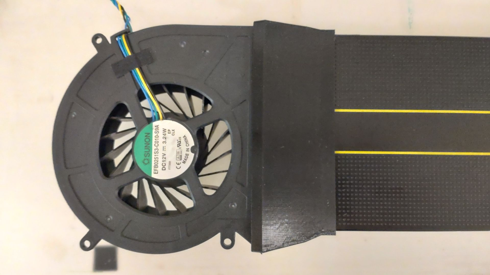

# mi50-sunon-efb0251s3-c010-s9a
AMD MI50 fan adapter for Sunon EFB0251S3-C010-S9A

## License
This is my first printable design, I have no idea what to put here. Print as many as you like. If you manage to make some profit doing that, good for you.

## Version 2
Fixes the issues with version 1. The fan now can be inserted without breaking anything, and doesn't come off without pulling.

## Version 1

* Fits the GPU fine. There's a bit too much space for the power plugs which causes a bit of backflow.
* The fan end is a bit too tight. Broke one of the adapters a bit pushing the fan in.

## AMD MI50
This might be of use if you want to make your own design. Grid: 0.5mm

